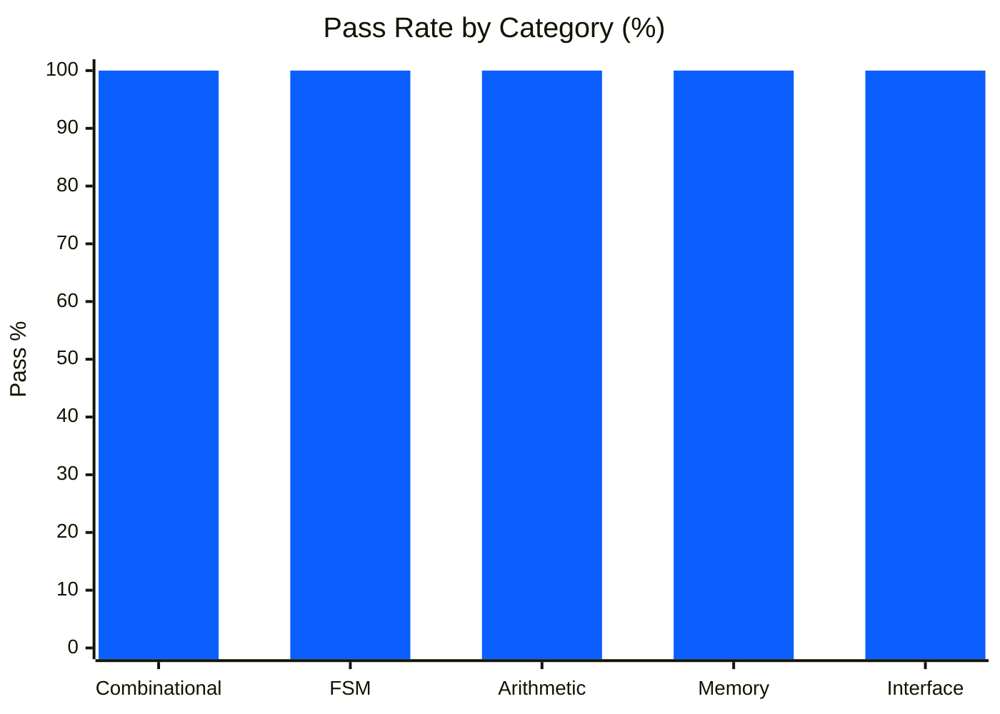
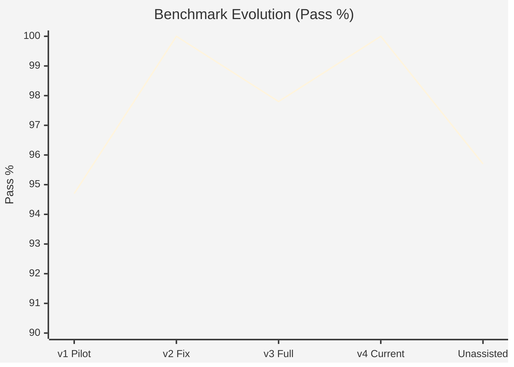
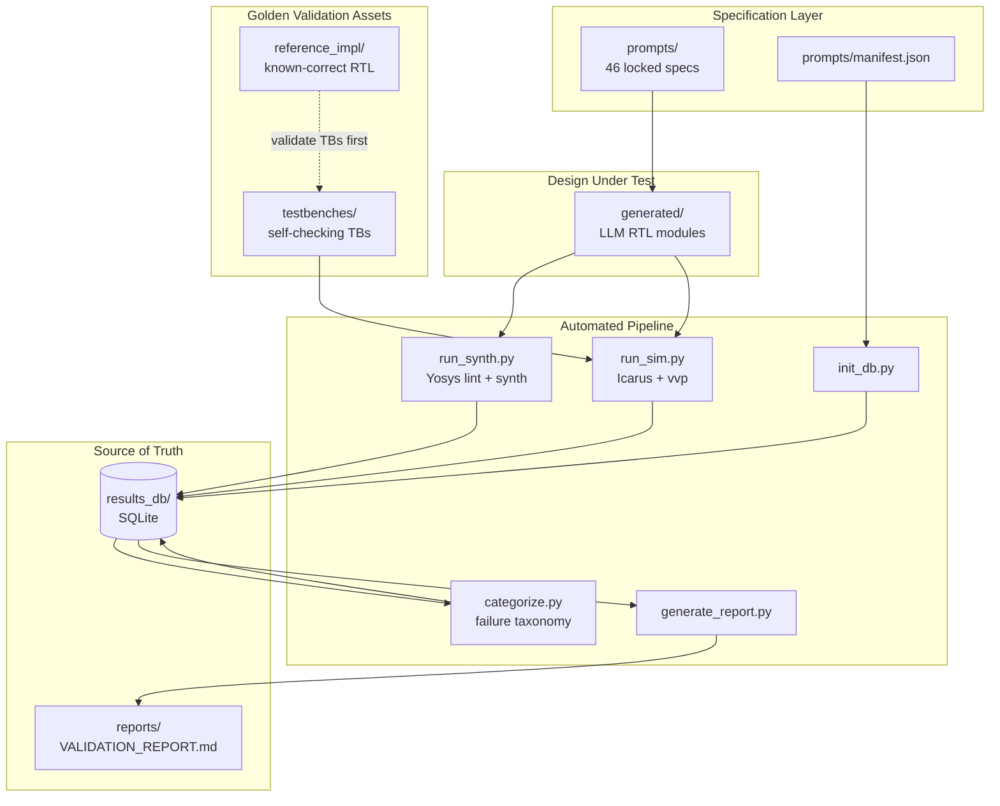
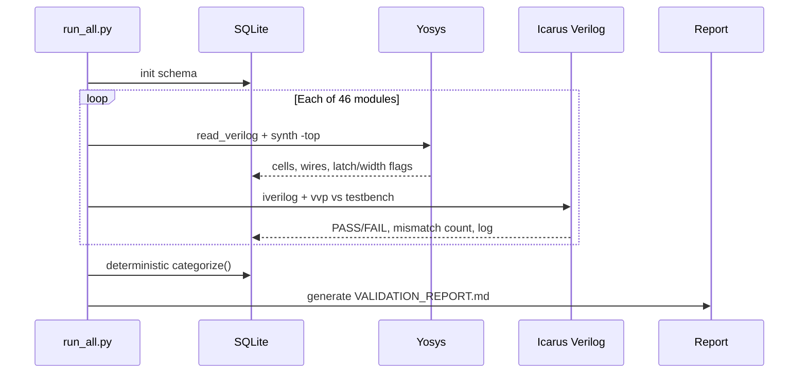
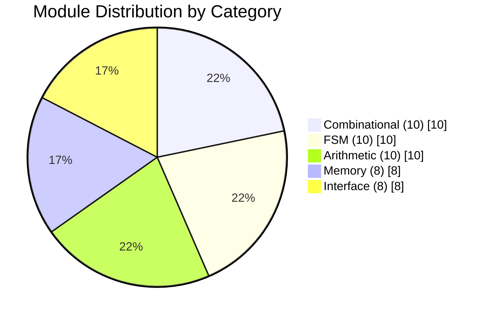
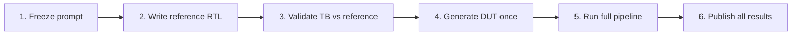

# LLM-HDL-Bench

### Automated Correctness Benchmark for LLM-Generated Verilog RTL

[-1f8a4c?style=for-the-badge)](reports/VALIDATION_REPORT.md)
[](prompts/manifest.json)
[](#benchmark-coverage)
[](#architecture)
[](.github/workflows/benchmark.yml)
[](LICENSE)

LLM-HDL-Bench is a fully automated **hardware verification framework** that measures whether LLM-generated RTL is *synthesizable* and *functionally correct*—not merely whether it looks plausible.

It combines **prompt-locked specification**, **reference-validated testbenches**, **Yosys lint/synthesis**, **Icarus Verilog simulation**, **deterministic failure taxonomy**, and a **machine-generated report** stored in SQLite. Every module is evaluated. No cherry-picking. No silent discards.

```text
Prompt Spec → Generated RTL → Yosys Synth → Icarus Sim → Categorize → SQLite → Report
```

---

## Highlights

| Capability | Detail |
|---|---|
| End-to-end EDA automation | Lint, synthesis, simulation, verdicts, report in one command |
| 46 RTL modules | Combinational, FSM, arithmetic, memory, interface |
| Zero third-party Python deps | Standard library only (`sqlite3`, `subprocess`, `json`, `re`) |
| Reproducible execution | Docker image + GitHub Actions CI |
| Honest baselines | Post-fix **46/46** and unassisted-equivalent **44/46** both reported |
| Failure taxonomy | Syntax, non-synthesizable, latch, compile, mismatch, timeout |

---

## Results Snapshot (v4)

### Aggregate Pass Rate

```text
██████████████████████████████████████████████████  46/46  (100.0%)
```

| Metric | Value |
|---|---|
| Modules evaluated | **46 / 46** |
| Aggregate pass rate (v4 post-fix) | **100.0%** |
| Unassisted-only equivalent | **44 / 46 (95.7%)** |
| Synthesis latch warnings | **0** |
| Harness unit tests | **9 / 9** |

### Pass Rate by Category



| Category | Modules | Pass | Rate |
|---|---:|---:|---:|
| Combinational | 10 | 10 | 100% |
| FSM | 10 | 10 | 100% |
| Arithmetic | 10 | 10 | 100% |
| Memory | 8 | 8 | 100% |
| Interface | 8 | 8 | 100% |

### Version History



| Run | Scope | Result | Notes |
|---|---|---|---|
| v1-pilot | 19 modules, single pass | 18/19 (94.7%) | Baseline pilot |
| v2 | 19 modules, 1 bug-fix | 19/19 (100%) | Iteration on pilot |
| v3 | 46 modules, full scope | 45/46 (97.8%) | One real edge-case miss |
| **v4 (current)** | 46 modules, edge-case fix | **46/46 (100%)** | `sign_magnitude_adder4` |
| Unassisted-only | 46 modules, no fixes | **44/46 (95.7%)** | First-try equivalent |

Full per-module detail: [`reports/VALIDATION_REPORT.md`](reports/VALIDATION_REPORT.md)

---

## Architecture



### Pipeline Stages



---

## Benchmark Coverage



| Category | Example Modules | What Is Exercised |
|---|---|---|
| **Combinational** | `mux4to1`, `priority_encoder8`, `bcd_to_7seg` | Pure logic, encoding, parity, arbitration |
| **FSM** | `traffic_light`, `sequence_detector_1011`, `vending_machine` | Moore/Mealy, sequencing, control |
| **Arithmetic** | `ripple_carry_adder4`, `lfsr8`, `multiplier4x4_shiftadd` | Add/sub, BCD, LFSR, saturation |
| **Memory** | `dual_port_ram`, `lifo_stack_8x8`, `circular_buffer_pointer_8x8` | Regfiles, RAM/ROM, pointers |
| **Interface** | `uart_tx`, `simple_spi_master`, `sync_fifo_8x8`, `cdc_synchronizer_2ff` | Serial I/O, FIFO, CDC, debounce |

---

## Methodology (No Cherry-Picking)



1. **Prompt freeze** — each module has a fixed specification before generation for that batch.
2. **Reference-first** — testbenches are proven against `reference_impl/` *before* any LLM RTL is scored.
3. **Single-pass generation policy** — DUT written once from the prompt alone (no testbench peeking during generation).
4. **Evaluate everything** — lint, synth, and sim results stored for every module.
5. **Programmatic report** — `VALIDATION_REPORT.md` is generated from SQLite; not hand-edited.
6. **Transparent baselines** — post-fix and unassisted-equivalent numbers are both disclosed.

### Failure Taxonomy (Deterministic)

| Priority | Category | Meaning |
|---|---|---|
| 1 | `syntax_error` | Parse / lint failure |
| 2 | `non_synthesizable` | Valid Verilog, synthesis fails |
| 3 | `toolchain_incompatible` | Tool limitation heuristic |
| 4 | `latch_inferred` | Unintended latch (quality/correctness signal) |
| 5 | `compile_error_sim` | Port/interface mismatch vs testbench |
| 6 | `sim_mismatch` | Functional incorrectness |
| 7 | `sim_timeout` | Non-terminating simulation |
| 8 | `unknown` | Needs manual review |

CI fails only when the **harness** crashes—not when DUT RTL fails a bench. A real failure is a valid benchmark result.

---

## Repository Layout

```text
llm-hdl-bench/
├── prompts/              # 46 frozen module specifications
├── reference_impl/       # Golden RTL (for TB validation only)
├── testbenches/          # Self-checking Verilog benches (1:1)
├── generated/            # DUT RTL under evaluation
├── pipeline/             # Orchestrator, synth, sim, categorize, report
│   ├── run_all.py
│   ├── run_synth.py
│   ├── run_sim.py
│   ├── categorize.py
│   ├── generate_report.py
│   └── test_pipeline.py  # 9 harness self-tests
├── results_db/           # SQLite source of truth
├── reports/              # Machine-generated validation report
├── .github/workflows/    # CI: tests → full benchmark
└── Dockerfile            # Ubuntu 24.04 + Yosys + Icarus
```

---

## Quick Start

### Docker (recommended)

```bash
git clone https://github.com/ArchanaChetan07/-LLM-HDL-Bench-Verilog-RTL-Validation-Framework.git
cd -LLM-HDL-Bench-Verilog-RTL-Validation-Framework
docker build -t llm-hdl-bench .
docker run --rm llm-hdl-bench
```

### Local toolchain

```bash
sudo apt-get install -y yosys iverilog
python3 pipeline/test_pipeline.py -v   # harness self-tests
python3 pipeline/run_all.py            # full end-to-end benchmark
cat reports/VALIDATION_REPORT.md
```

### Individual stages

```bash
python3 pipeline/init_db.py
python3 pipeline/run_synth.py
python3 pipeline/run_sim.py
python3 pipeline/categorize.py
python3 pipeline/generate_report.py
```

---

## Engineering Stack

| Layer | Technology |
|---|---|
| HDL | Verilog / SystemVerilog synthesizable subset |
| Synthesis & lint | [Yosys](https://yosyshq.net/yosys/) 0.33 |
| Simulation | [Icarus Verilog](http://iverilog.icarus.com/) 12.0 (`iverilog` + `vvp`) |
| Orchestration | Python 3 (stdlib only) |
| Persistence | SQLite |
| Packaging | Docker (Ubuntu 24.04) |
| Continuous integration | GitHub Actions |

### Skills Demonstrated

- **Digital design & HDL** — synthesizable Verilog across logic, FSM, arithmetic, memory, and I/O
- **EDA toolchain automation** — Yosys synthesis scripting, Icarus compile/sim flows
- **Verification methodology** — self-checking testbenches, reference models, mismatch accounting
- **Systems / CI engineering** — Dockerized reproducible builds, Actions pipelines, SQLite result stores
- **Software quality** — harness unit tests, deterministic categorizer, regression guards (e.g. `PROC_DLATCH` false-positive latch detector)
- **Technical writing with integrity** — retracted analysis claims disclosed when wrong; dual baselines reported

---

## What This Proves — And What It Doesn't

**Proves (scoped):** for this generation, this 46-prompt suite, and this toolchain (Yosys 0.33 / Icarus 12.0), modules are synthesizable and match paired self-checking benches under the documented methodology.

**Does not prove:** generalization to other models, production-scale SoCs, or formal timing signoff (generic Yosys synth ≠ STA).

---

## Extending the Benchmark

The pipeline is **model-agnostic**. Drop new RTL into `generated/` and re-run `pipeline/run_all.py`.

To expand the prompt set:

1. Add + freeze prompts under `prompts/<category>/`
2. Update `prompts/manifest.json`
3. Add reference RTL and validate the testbench against it
4. Generate DUT RTL
5. Run `python3 pipeline/run_all.py`

---

## Integrity Notes

Two earlier analysis claims were investigated and **retracted** (disclosure kept on purpose):

- `uart_tx` — alleged 11-cycle timing bug was a *write-up* error, not an RTL defect.
- `circular_buffer_pointer_8x8` — suspected double pointer advance is last-assignment-wins for repeated nonblocking assigns in one `always` block; not a functional bug.

The v3 `sign_magnitude_adder4` miss (equal magnitude, opposite signs → must return `+0`) was a confirmed sim mismatch and was corrected in v4. Unassisted history remains in the version table above.

---

## License

MIT — see [`LICENSE`](LICENSE).

---

<p align="center">
  <b>LLM-HDL-Bench</b> — measure generated RTL the way hardware teams measure silicon readiness:<br/>
  synthesize it, simulate it, store every result, and publish without filtering.
</p>
