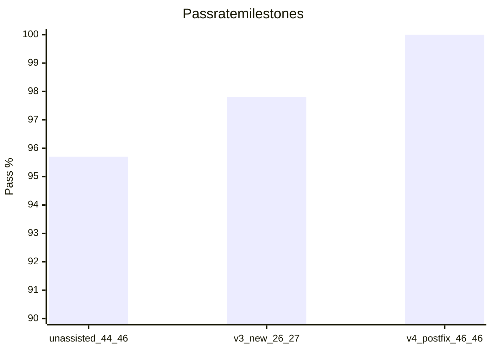
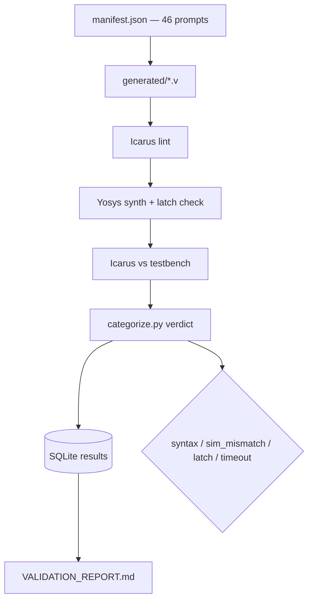
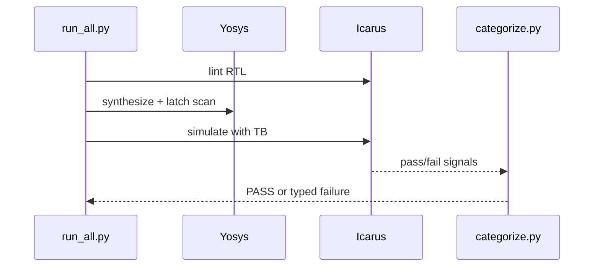

# LLM HDL Bench — Verilog RTL Validation Framework

### Honest LLM-generated RTL benchmark — 46 SystemVerilog designs × 5 categories, Yosys + Icarus, v4 **46/46**

[](https://github.com/ArchanaChetan07/-LLM-HDL-Bench-Verilog-RTL-Validation-Framework/actions/workflows/ci.yml)
[-1f8a4c)](reports/VALIDATION_REPORT.md)
[](prompts/manifest.json)
[](pipeline/test_pipeline.py)
[](Dockerfile)

Production-minded **LLM RTL evaluation harness** used to score generated SystemVerilog for lint, synthesis, and simulation correctness. Separates **post-fix** pass rate from **unassisted** baselines so model claims stay honest — the kind of evaluation discipline expected in silicon/AI hardware interviews.

---

## Impact Snapshot

| Signal | Verified value | Evidence |
|---|---|---|
| RTL prompts | **46** across **5** categories | `prompts/manifest.json` |
| Category mix | comb **10** · FSM **10** · arith **10** · mem **8** · iface **8** | same |
| Matching testbenches | **46** | `testbenches/` |
| **v4 post-fix** | **46/46 (100%)** | `reports/VALIDATION_REPORT.md` |
| Unassisted baseline | **44/46** | report (v1 18/19 + v3 26/27) |
| v3 unassisted (27 new) | **26/27 (97.8%)** | report history |
| Pipeline modules / tests | **7** / **9** passing | `pipeline/` |
| EDA toolchain | Yosys **0.33** + Icarus **12.0** | validation report |
| Containerized run | **Yes** | `Dockerfile` |



---

## Architecture





---

## Engineering Skills Demonstrated

SystemVerilog / Verilog · RTL validation · Yosys synthesis · Icarus simulation · Python orchestration · SQLite result stores · Dockerized EDA · CI for hardware-adjacent ML eval · honest benchmarking methodology · FSM/arithmetic/memory/CDC interface coverage · regression tests for tool false positives

---

## Category Coverage

| Category | Count | Examples |
|---|---:|---|
| combinational | 10 | mux4to1, priority_encoder8, bcd_to_7seg |
| fsm | 10 | traffic_light, vending_machine, sequence_detector_1011 |
| arithmetic | 10 | ripple_carry_adder4, lfsr8, sign_magnitude_adder4 |
| memory | 8 | sync_regfile_4x8, dual_port_ram, lifo_stack_8x8 |
| interface | 8 | uart_tx, sync_fifo_8x8, cdc_synchronizer_2ff |

---

## Quick Start

```bash
git clone https://github.com/ArchanaChetan07/-LLM-HDL-Bench-Verilog-RTL-Validation-Framework.git
cd -LLM-HDL-Bench-Verilog-RTL-Validation-Framework

python pipeline/test_pipeline.py
# Full bench (needs Yosys + iverilog on PATH, or use Docker):
python pipeline/run_all.py
python pipeline/generate_report.py
```

---

## Design Notes

1. **Honesty over vanity metrics** — post-fix vs unassisted rates are reported separately.
2. **Typed failures** — syntax, sim mismatch, latch, timeout are first-class for model error analysis.
3. No FastAPI / Kubernetes / Prometheus layers — the product is the EDA validation loop.

---

## Future Work

- Multi-model leaderboard CSV with temperature/seed controls
- Formal checkers (SymbiYosys) as an optional fourth gate
- Prompt difficulty tagging for stratified pass rates

---

## License

See repository license file if present.
