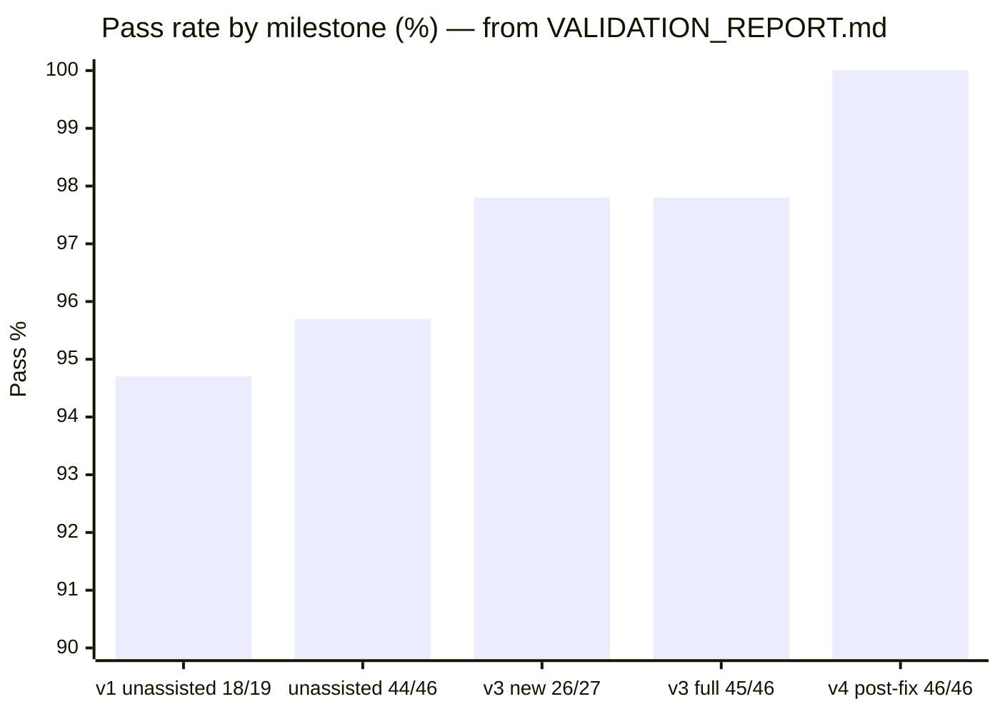
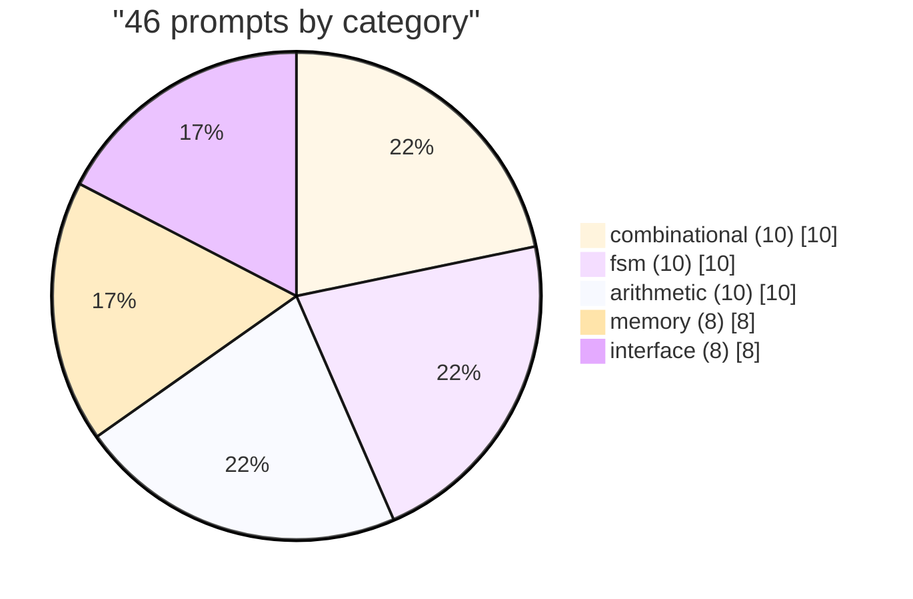
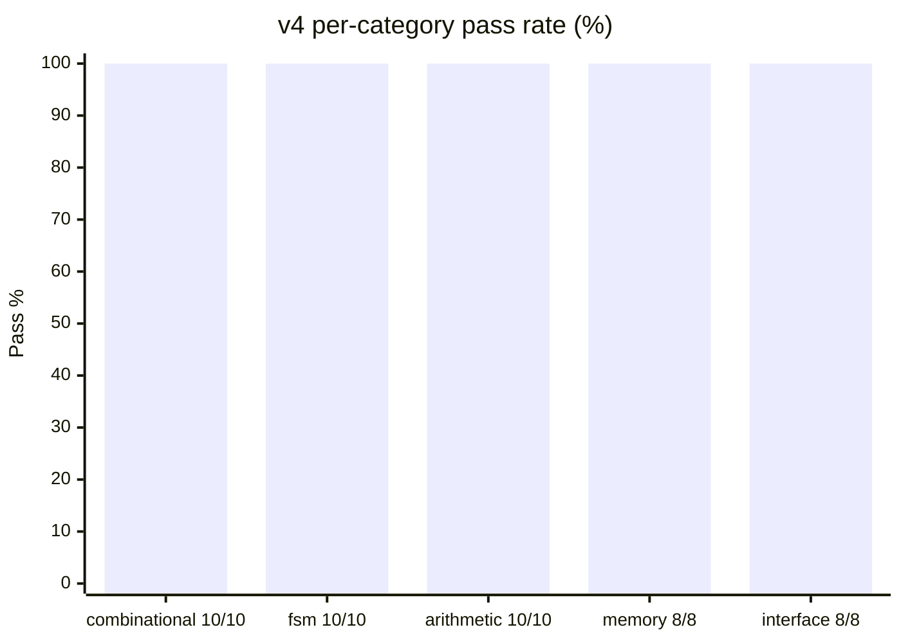
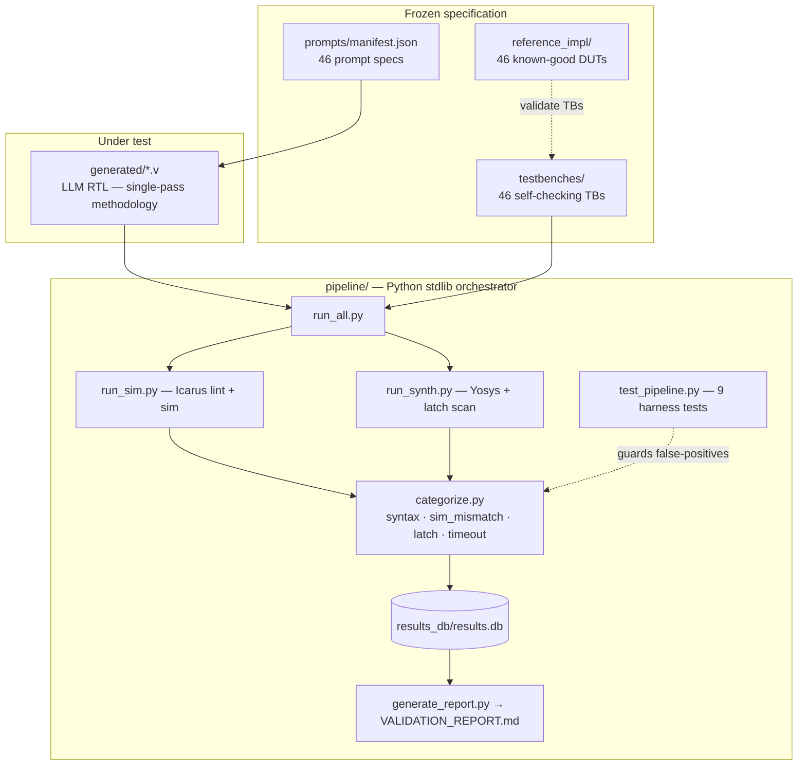
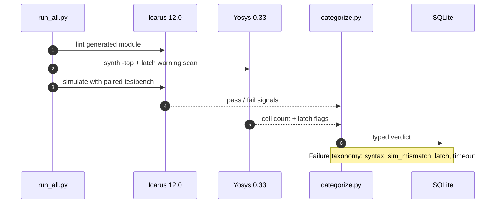
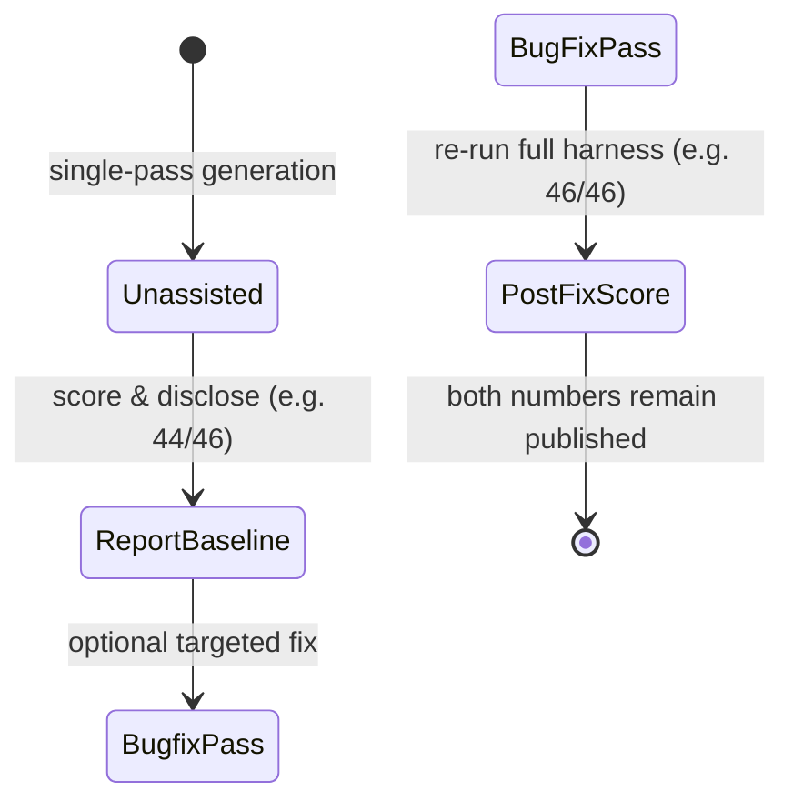
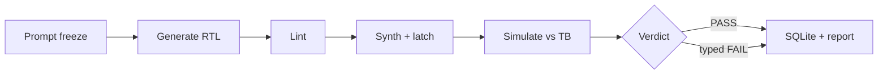

# LLM-HDL-Bench

### Hardware-grade evaluation of LLM-generated RTL — lint · synthesize · simulate · report

**46 SystemVerilog modules · 5 digital categories · Yosys 0.33 + Icarus 12.0 · Docker · CI**  
**Verified: v4 post-fix `46/46 (100%)` · Honest unassisted baseline `44/46 (95.7%)`**

[](https://github.com/ArchanaChetan07/-LLM-HDL-Bench-Verilog-RTL-Validation-Framework/actions/workflows/benchmark.yml)
[-148F40)](reports/VALIDATION_REPORT.md)
[-0B6E4F)](reports/VALIDATION_REPORT.md)
[](prompts/manifest.json)
[](pipeline/test_pipeline.py)
[](pipeline/config.json)
[](Dockerfile)
[](LICENSE)
[](requirements.txt)

---

## Why this exists

LLM demos of “I generated a UART” are not an evaluation method. Silicon and AI-hardware teams need **reproducible, tool-backed correctness** — the same bar applied to compiler/testinfra candidates at FAANG-scale platforms.

**LLM-HDL-Bench** is an end-to-end RTL validation framework that:

1. Freezes **46** prompts across **combinational · FSM · arithmetic · memory · interface**  
2. Runs every `generated/*.v` module through **Icarus lint → Yosys synthesis (+ latch scan) → Icarus simulation vs a 1:1 testbench**  
3. Stores typed verdicts in **SQLite** and regenerates `reports/VALIDATION_REPORT.md` programmatically (never hand-edited)  
4. Publishes **both** post-fix pass rates **and** unassisted baselines so **100% is never misread as a first-pass claim**

> Metrics in this README are copied verbatim from `reports/VALIDATION_REPORT.md`, `prompts/manifest.json`, and `pipeline/config.json`. They are **not** altered.

---

## Results at a glance

| Metric | Value | Evidence |
|---|---|---|
| Prompt suite | **46** modules / **5** categories | `prompts/manifest.json` |
| Category mix | comb **10** · FSM **10** · arith **10** · mem **8** · iface **8** | same |
| Paired self-checking testbenches | **46** | `testbenches/` |
| Reference impls (harness validation) | **46** | `reference_impl/` |
| **v4 post-fix aggregate** | **46/46 (100.0%)** | `reports/VALIDATION_REPORT.md` |
| **All-unassisted equivalent** | **44/46 (95.7%)** | report history |
| v1 pilot (unassisted) | **18/19 (94.7%)** | report / commit `e98ea20` |
| v2 after one fix pass | **19/19 (100%)** | commit `20ae26f` |
| v3 full scope | **45/46 (97.8%)** | report |
| v3 new-modules first pass | **26/27 (97.8%)** | report |
| Per-category (v4) | all **100%** (10/10, 10/10, 10/10, 8/8, 8/8) | report |
| Failures in v4 | **0** | report |
| Pipeline Python modules | **7** (`init_db`…`generate_report`) | `pipeline/` |
| Harness unit tests | **9** passing | `pipeline/test_pipeline.py` |
| Toolchain | Yosys **0.33** · Icarus Verilog **12.0** | `pipeline/config.json` |
| Python deps | **stdlib only** (sqlite3, subprocess, …) | `requirements.txt` |
| License | **MIT** | `LICENSE` |

### Pass-rate trajectory (unchanged numbers)



### Category coverage (prompt counts)



### v4 category pass rates (all 100%)



---

## System architecture



### Per-module gate sequence



### Observe → revise honesty model



---

## Category catalog

| Category | N | Representative modules |
|---|---:|---|
| **combinational** | 10 | `mux4to1`, `priority_encoder8`, `bcd_to_7seg`, `decoder3to8`, `majority_vote3` |
| **fsm** | 10 | `traffic_light`, `vending_machine`, `sequence_detector_1011`, `moore_edge_detector`, `elevator_2floor` |
| **arithmetic** | 10 | `ripple_carry_adder4`, `lfsr8`, `multiplier4x4_shiftadd`, `sign_magnitude_adder4`, `bcd_adder` |
| **memory** | 8 | `dual_port_ram`, `sync_fifo`-class stacks/`lifo_stack_8x8`, `circular_buffer_pointer_8x8`, `sync_regfile_4x8` |
| **interface** | 8 | `uart_tx`, `sync_fifo_8x8`, `cdc_synchronizer_2ff`, `simple_spi_master`, `button_debouncer` |

Synthesized cell counts (Yosys generic) are recorded per module in the validation report — e.g. `dual_port_ram` **609** cells, `sync_fifo_8x8` **188**, `mux4to1` **3** — useful for complexity stratification in follow-on model comparisons.

---

## Methodology (what “honest” means here)

From `pipeline/config.json` and the report changelog:

- **Single-pass generation policy** for the unassisted baseline: one RTL write per prompt, no retry loop, no consulting the paired testbench during generation.  
- **Post-fix rates are labeled as such** — v4 fixes the v3 `sign_magnitude_adder4` edge case (equal magnitudes / opposite signs → `+0`) and re-runs all **46** modules.  
- **Retractions are disclosed** when investigation clears a suspected bug (e.g. `circular_buffer_pointer_8x8` nonblocking assign semantics).  
- **Harness ≠ DUT**: CI fails if the *pipeline* breaks; RTL under-test failures are recorded as benchmark data, not as CI red.



---

## Skills this repository demonstrates

| Domain | Concrete signals |
|---|---|
| **Digital design / EDA** | SystemVerilog/Verilog RTL, FSMs, CDC 2FF, UART/SPI/FIFO, Yosys synth, Icarus sim |
| **LLM evaluation** | Frozen prompt suite, typed failure taxonomy, unassisted vs post-fix reporting |
| **Software / platforms** | Python orchestration, SQLite, Dockerized Ubuntu 24.04 toolchain, GitHub Actions artifact upload |
| **Engineering discipline** | Programmatic reports, harness unit tests (incl. Yosys `PROC_DLATCH` false-positive guard), MIT license |

Keyword surface for discovery: **SystemVerilog · Verilog · RTL · Yosys · Icarus · HDL · ASIC/FPGA-adjacent validation · LLM benchmark · Python · Docker · CI/CD · SQLite · synthesis · simulation · CDC · UART · FIFO · FSM**

---

## Quick start

### Docker (recommended — no local EDA install)

```bash
git clone https://github.com/ArchanaChetan07/-LLM-HDL-Bench-Verilog-RTL-Validation-Framework.git
cd -- -LLM-HDL-Bench-Verilog-RTL-Validation-Framework

docker build -t llm-hdl-bench .
docker run --rm llm-hdl-bench
# CMD runs: python3 pipeline/run_all.py
```

### Local toolchain

```bash
# Ubuntu/Debian
sudo apt-get update && sudo apt-get install -y yosys iverilog python3

python3 pipeline/test_pipeline.py -v   # harness self-tests first
python3 pipeline/run_all.py            # full 46-module bench
# report: reports/VALIDATION_REPORT.md
```

### CI

On changes under `prompts/`, `testbenches/`, `generated/`, or `pipeline/`, [`.github/workflows/benchmark.yml`](.github/workflows/benchmark.yml) installs Yosys + Icarus, runs harness tests + full pipeline, and uploads `results_db/results.db` + the validation report as artifacts.

---

## Repository layout

```text
-LLM-HDL-Bench-Verilog-RTL-Validation-Framework/
├── prompts/              # 46 frozen .md specs + manifest.json
├── generated/            # RTL under test
├── reference_impl/       # known-good DUTs (validate TBs, not scored as LLM)
├── testbenches/          # 46 self-checking benches
├── pipeline/             # lint/synth/sim/categorize/SQLite/report + 9 unit tests
├── results_db/           # results.db (source of truth)
├── reports/              # VALIDATION_REPORT.md (generated)
├── Dockerfile            # Ubuntu 24.04 + yosys + iverilog
└── .github/workflows/    # benchmark.yml
```

---

## Design principles

1. **Honesty over vanity** — publish unassisted **44/46** beside post-fix **46/46**.  
2. **Typed failures** — syntax / sim mismatch / latch / timeout for error analysis.  
3. **Reproducibility** — Docker + pinned toolchain versions in config.  
4. **Zero cherry-picking** — every module listed in the generated report.  
5. **Stdlib pipeline** — no hidden Python dependency graph.

---

## Known limitations (from the report)

Results are scoped to this generation, this 46-prompt set, and Yosys **0.33** / Icarus **12.0**. They do **not** generalize to other models, large SoC RTL, or production STA/signoff flows. Yosys `synth` here targets **generic** cells (synthesizability + warnings), not a foundry library.

---

## Future improvements

- Multi-model leaderboard CSV (temperature / seed controls)  
- Optional SymbiYosys formal gate  
- Prompt difficulty tags for stratified pass rates  

---

## License

MIT © 2026 Archana Chetan — see [`LICENSE`](LICENSE).

---

<p align="center">
  <b>LLM-HDL-Bench</b> — measurable RTL correctness for LLM evaluation.<br/>
  <a href="https://github.com/ArchanaChetan07/-LLM-HDL-Bench-Verilog-RTL-Validation-Framework">github.com/ArchanaChetan07/-LLM-HDL-Bench-Verilog-RTL-Validation-Framework</a>
</p>
