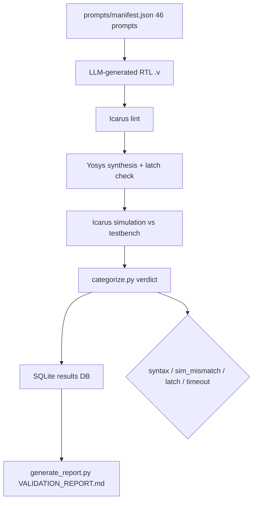

# LLM HDL Bench — Verilog RTL Validation Framework

### Honest LLM RTL benchmark — 46 SystemVerilog prompts × 5 categories, Yosys + Icarus, v4 post-fix 46/46

[](https://github.com/ArchanaChetan07/-LLM-HDL-Bench-Verilog-RTL-Validation-Framework/actions/workflows/ci.yml)
[](prompts/manifest.json)
[](pipeline/)
[](pipeline/test_pipeline.py)
[](#license)

Reproducible **LLM-generated RTL validation harness**: 46 prompts across combinational, FSM, arithmetic, memory, and interface categories; lint → Yosys synthesis → Icarus simulation pipeline with SQLite result tracking and an honest report separating **post-fix pass rate** from **unassisted first-pass** baselines.

---

## Key Results

| Metric | Value | Source |
|---|---|---|
| RTL prompts | **46** | `prompts/manifest.json` |
| Categories | **5** (10+10+10+8+8) | same manifest |
| Testbenches | **46** `.v` files | `testbenches/` |
| v4 post-fix pass rate | **46/46 (100%)** | `reports/VALIDATION_REPORT.md` |
| All-unassisted baseline | **44/46** | same report (v1 pilot 18/19 + v3 new 26/27) |
| v3 unassisted (27 new modules) | **26/27 (97.8%)** | report history table |
| Pipeline Python modules | **7** | `pipeline/` |
| Pipeline unit tests | **9** passing | `pipeline/test_pipeline.py` |
| Toolchain | **Yosys 0.33 + Icarus Verilog 12.0** | `reports/VALIDATION_REPORT.md` |
| Docker | **Yes** | `Dockerfile` |
| FastAPI / K8s / Prometheus | **None** | not present in repo |

---

## Architecture



**How it works:** `pipeline/run_all.py` orchestrates lint, synthesis (`run_synth.py`), and simulation (`run_sim.py`) for each manifest entry. `categorize.py` assigns verdicts (PASS, syntax_error, sim_mismatch, sim_timeout, etc.). `generate_report.py` writes an honest markdown report with separate post-fix and unassisted baselines. `test_pipeline.py` guards pipeline logic (e.g., PROC_DLATCH false-positive regression).

---

## Tech Stack

| Layer | Choice |
|---|---|
| HDL | SystemVerilog / Verilog RTL + testbenches |
| EDA | Yosys (synthesis), Icarus Verilog (lint + sim) |
| Orchestration | Python 3 pipeline + SQLite |
| CI | GitHub Actions |
| Container | Docker (toolchain packaging) |

---

## Installation & Usage

```bash
git clone https://github.com/ArchanaChetan07/-LLM-HDL-Bench-Verilog-RTL-Validation-Framework.git
cd -LLM-HDL-Bench-Verilog-RTL-Validation-Framework
python pipeline/test_pipeline.py
python pipeline/run_all.py    # requires Yosys + iverilog on PATH
python pipeline/generate_report.py
```

Generated RTL lives under `generated/`; prompts and reference testbenches are versioned under `prompts/` and `testbenches/`.

---

## Category Breakdown

| Category | Prompts | Examples |
|---|---|---|
| combinational | 10 | mux4to1, priority_encoder8, bcd_to_7seg |
| fsm | 10 | traffic_light, vending_machine, sequence_detector_1011 |
| arithmetic | 10 | ripple_carry_adder4, lfsr8, sign_magnitude_adder4 |
| memory | 8 | sync_regfile_4x8, dual_port_ram, lifo_stack_8x8 |
| interface | 8 | uart_tx, sync_fifo_8x8, cdc_synchronizer_2ff |

---

## License

See repository license file if present.
